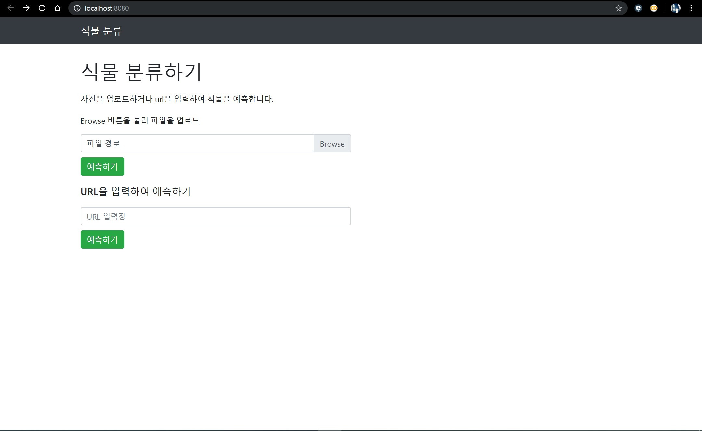
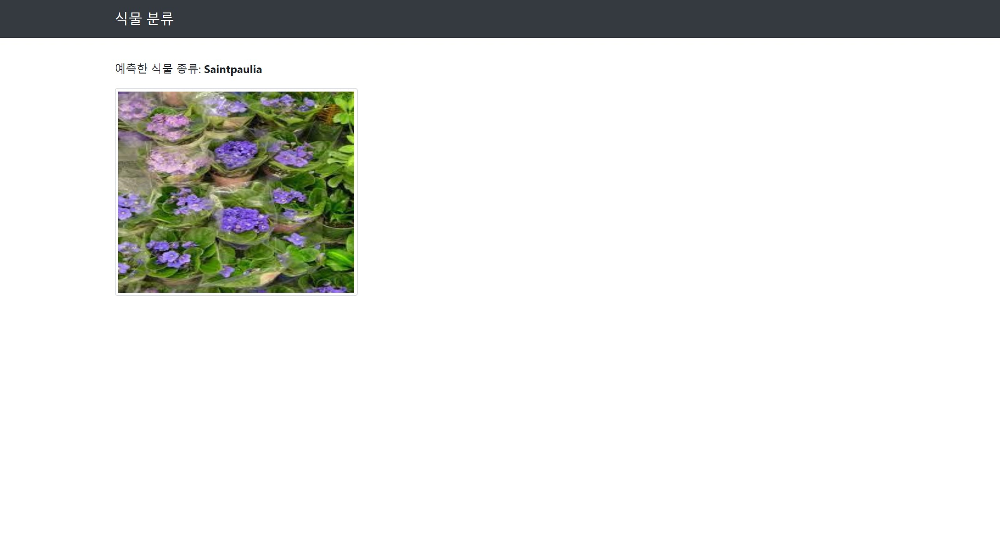
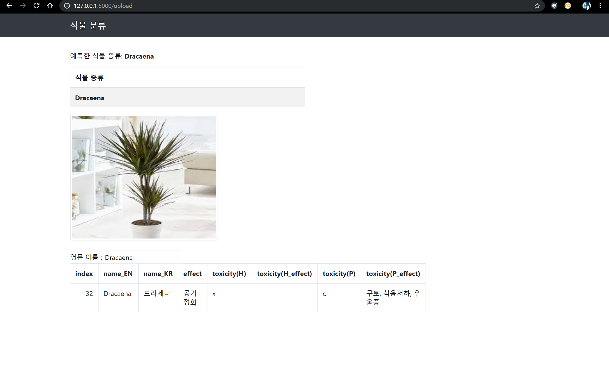
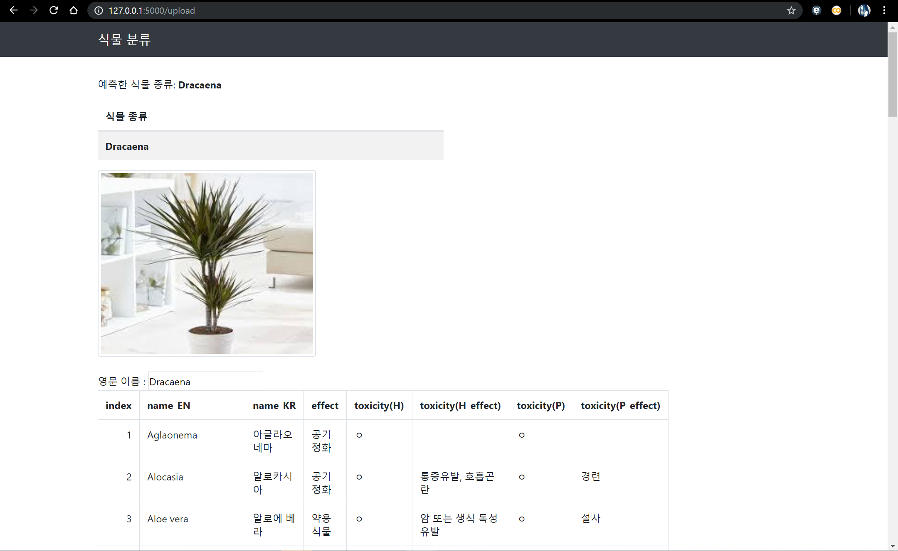

 # 대학 Capstone Design 자료
 - 논문 참조: Journal of Knowledge Information Technology and Systems(JKITS), Vol. 15, No. 2, pp. 167 -175, April 2020 
 - 논문명: [Vol.15, No.2] Indoor Plan ts Image Classi fication Using Deep Learning and Web Application for Providing In formation of Plants

 -  논문 링크: https://doi.org/10.34163/jkits.2020.15.2.002
 
 ## Web App

1. 동작 환경
    - 환경: python 3.7.3, pytorch 1.1.0, fastai 1.0.55, flask 1.0.2, 
    - 개발 IDE : PyCharm 2019.2 (Professional)
    - 개발 언어 : python(fastai: 이미지 분석 관련부분, flask : 웹 렌더링 부분), html 및 javascript(웹 렌더링 및 이벤트 처리)
    
2. 파일 구조 : [Github fork](https://github.com/dspanah/Skin-Cancer-Detection-TransferLearning-Fastai-Flask)

flask 파일 
- plant/models : 백업용 모델 저장
- plant/src : 실행 파일이 있는 곳
  - plant/src/models : 실행하는 모델이 위치
  - plant/src/static : 웹의 디자인, js 파일이 저장되있는 폴더
  - plant/src/templates : html 파일이 있는 폴더
  - plant/src/app.py :  앱 실행을 위한 .py 파일

3. 실행 결과

메인화면

초기 웹앱 (단순한 이미지 삽입, 분석 후 식물 종을 분석하는 화면)

초기 웹앱의 기능을 포함하여 식물의 정보를 알 수 있게 아래의 표로 나타낼 수 있다.

4. 현재 알려진 문제점

식물의 정보가 바로 나오지 않고 추가적인 작업을 해주어야 자바스크립트가 정상적으로 작동됨

