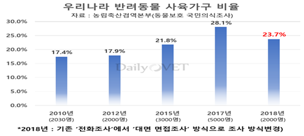
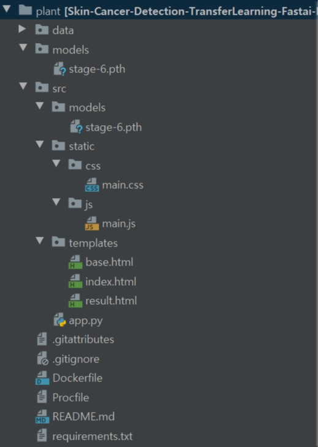
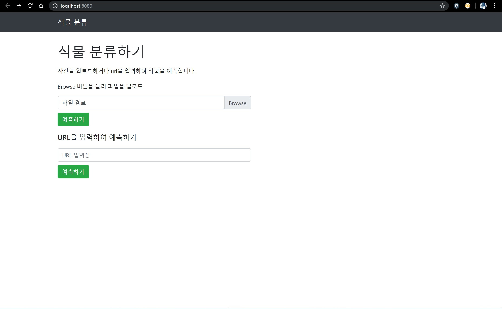
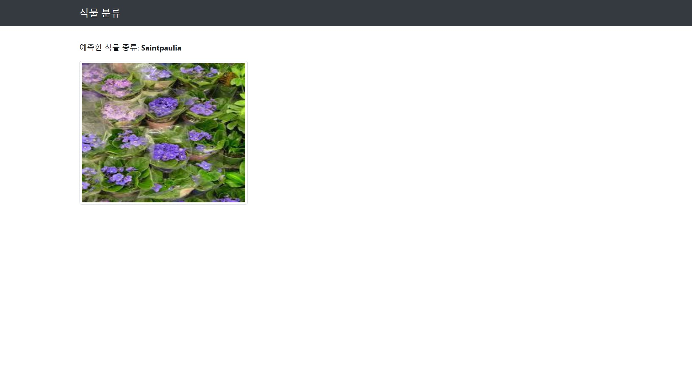
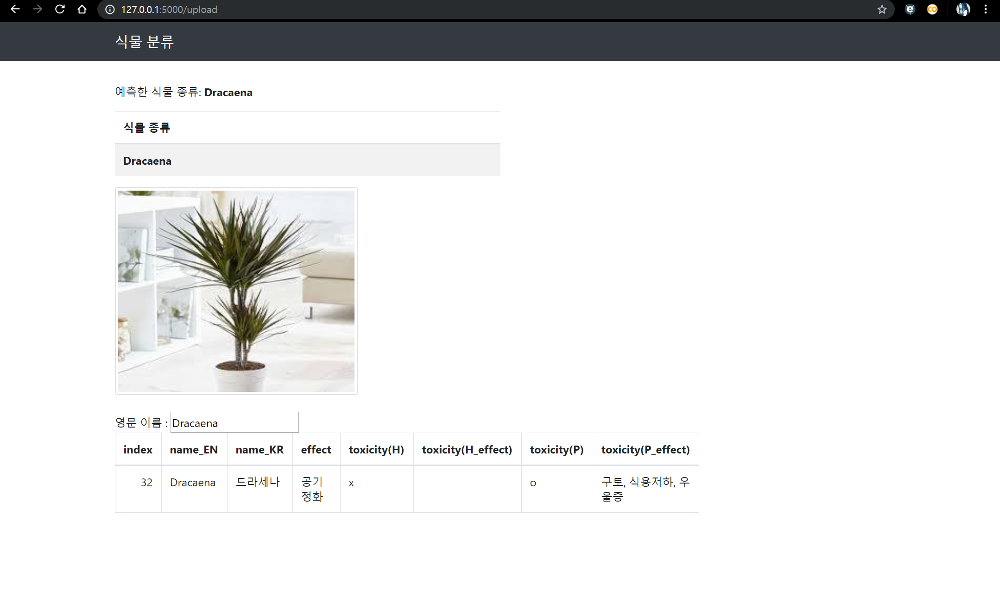
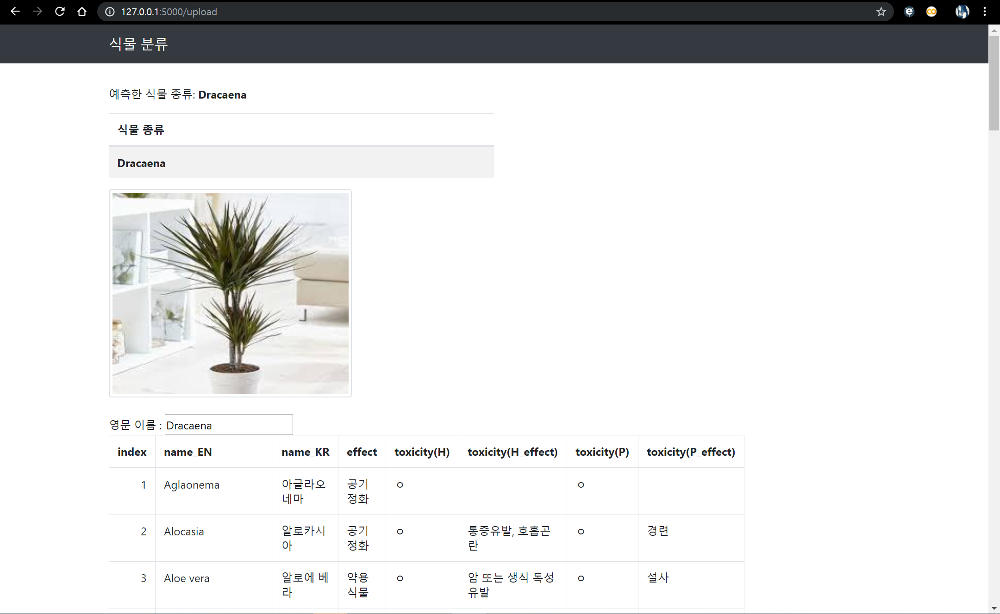

 # Web App
1.  개요
    -  ‘펫팸족’은 반려동물 ‘pet’ 과 ‘family’의 합성어로 반려동물을 가족처럼 여기는 사람들을 뜻하는 신조어입니다. 이처럼 농림축산식품부가 조사한 ‘2018 반려동물 의식조사’에 따르면 현재 반려동물 보유 가구 비율은 전체의 500만 가구를 훌쩍 넘어 23.7%에 달합니다. 
    즉, 4가구 중 1가구는 반려동물을 기르고 있다는 의미입니다. 또한 요즘 미세먼지와 각종 공기 오염으로 집안의 공기를 정화해주고 심리적 안정을 위해 허브와 난, 꽃과 같은 다양한 식물들도 가족의 일원으로 받아들이는 ‘반려식물 족’도 늘어나고 있습니다. 그러나 반려동물과 같이 몸을 움직일 수 없는 식물들은 외부의 공격으로부터 자신을 보호하기 위해 독성으로 자신을 지키는 식물이 있습니다. 이처럼 반려동물이 독성이 있는 식물을 섭취하면 구토와 복통 등 최악의 경우 사망에 이르게 될 수 있다고 합니다. 이에 맞춰 저희는 반려동물에게 해로운 식물인지 판단해 위험성을 깨닫고 예방하기 위해 만들게 되었습니다.  



```
《참고자료》
http://www.ohmynews.com/NWS_Web/view/at_pg.aspx?CNTN_CD=A0002281586
http://www.fnnews.com/news/201903141816426458
https://joubebe.com/bbs_detail.php?bbs_num=555&tb=news_news
```

2. 동작 환경
    - 환경: python 3.7.3, pytorch 1.1.0, fastai 1.0.55, flask 1.0.2, 
    - 개발 IDE : PyCharm 2019.2 (Professional)
    - 개발 언어 : python(fastai: 이미지 분석 관련부분, flask : 웹 렌더링 부분), html 및 javascript(웹 렌더링 및 이벤트 처리)
    
3. 파일 구조 : [Github fork](https://github.com/dspanah/Skin-Cancer-Detection-TransferLearning-Fastai-Flask)


flask 파일 
- plant/models : 백업용 모델 저장
- plant/src : 실행 파일이 있는 곳
  - plant/src/models : 실행하는 모델이 위치
  - plant/src/static : 웹의 디자인, js 파일이 저장되있는 폴더
  - plant/src/templates : html 파일이 있는 폴더
  - plant/src/app.py :  앱 실행을 위한 .py 파일

4. 실행 결과


메인화면


초기 웹앱 (단순한 이미지 삽입, 분석 후 식물 종을 분석하는 화면)


초기 웹앱의 기능을 포함하여 식물의 정보를 알 수 있게 아래의 표로 나타낼 수 있다.

5. 현재 알려진 문제점


식물의 정보가 바로 나오지 않고 추가적인 작업을 해주어야 자바스크립트가 정상적으로 작동됨

